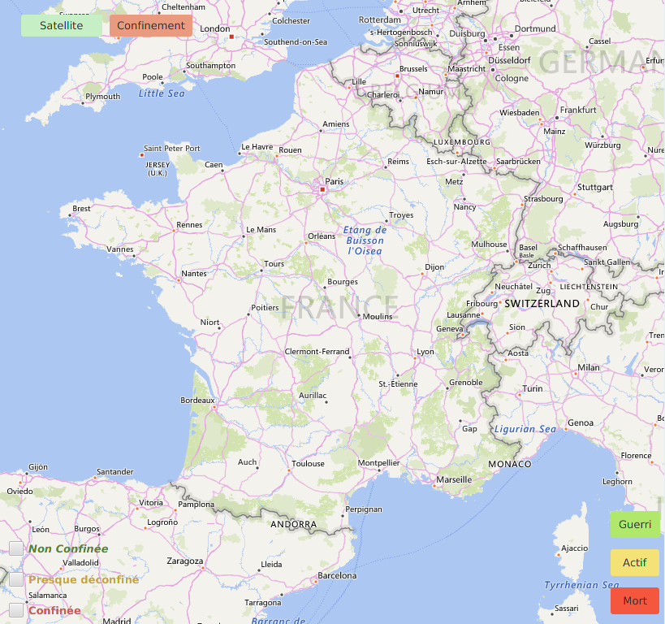
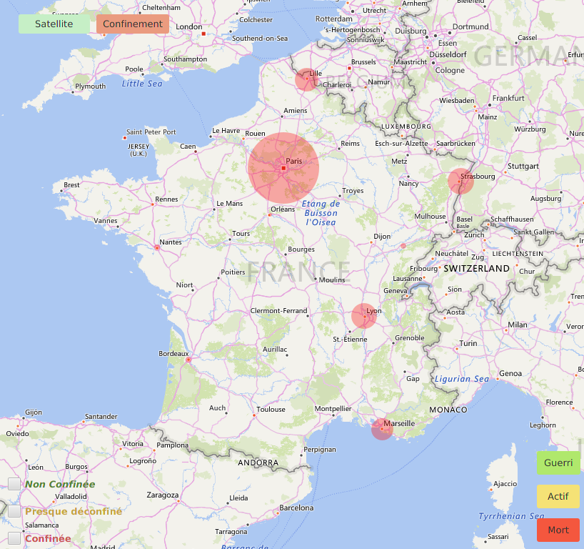
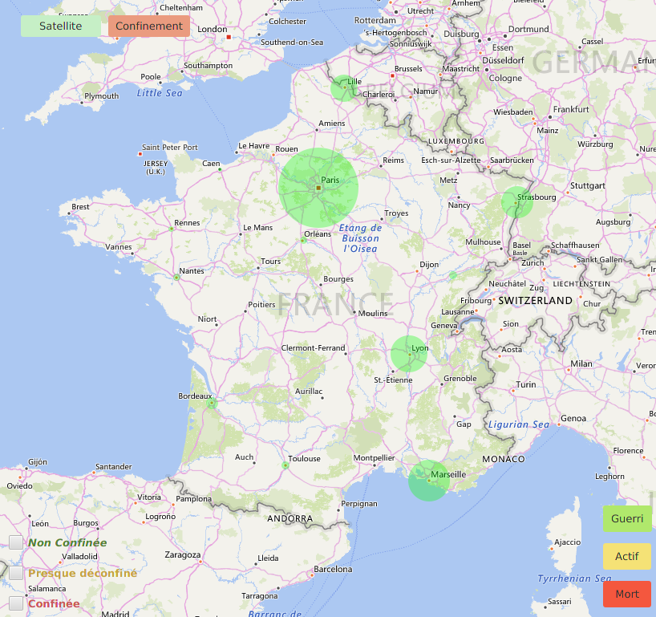
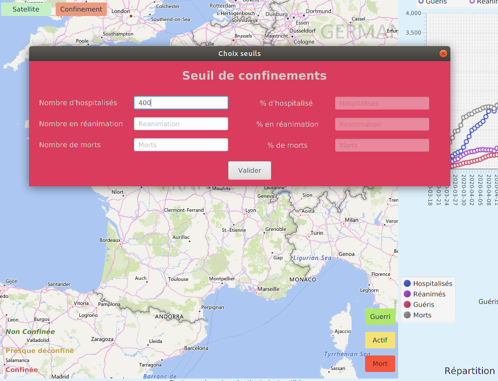
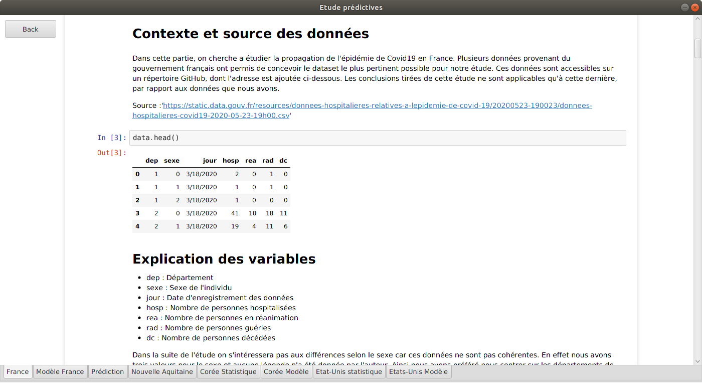

# Application COVID-19

L'application permet dans un premier lieu de prendre connaissance de l'état actuel de l'épidémie, via une carte interractive, puis de calculer un itinéraire entre deux villes non confinée, en évitant les villes confinées.

## Mise en place
Pour utiliser notre application avec Eclipse, il vous vaudra d'abord suivre ces quelques étapes :
<ul>
  <li> Télécharger JDK12 en suivant ce lien : https://www.oracle.com/java/technologies/javase/jdk12-archive-downloads.html </li>
  <li> Télécharger JavaFX en suivant ce lien : https://gluonhq.com/products/javafx/ version 14.0.1 </li>
  <li> Mettre en place JDK12 dans Eclipse Window -> Preference -> Java -> Installed JRE -> Add -> Standart VM -> Directory </li>
  <li> Mettre en place une user library dans Eclipse avec JavaFX </li>
  <li> Ajouter dans le BuildPath les éléments précédents, ainsi que les trois .jar présents dans le dossier <i>librarie externe</i> du projet </li>
  <li> Télecharger les librairies joblib et numpy de Python à l'aide de la commande : <i>pip3 install joblib</i></li>
</ul>
  

## Démarage de l'application
Au démarage, une première fenêtre s'ouvre. Il s'agit de se connecter au serveur mysql. 

Si vous avez déjà un compte que vous souhaitez utiliser, entrez votre nom d'utilisateur et mot de passe dans les champs de l'onglet "connexion". 

Si vous souhaitez créer un nouveau compte, entrez les nom d'utilitisateur et mot de passe souhaités ainsi que votre mot de passe root dans les champs de l'onglet "Nouveau compte". 

## Création et mise à jour de la base de données
Une fois connecté, vous accédez à la page d'accueil de l'application. 

### Installation de la base de données
Si vous lancez l'application pour la première fois, ou si vous souhaitez recréer entièrement la base de données, sélectionnez "Installer". Une barre de chargement s'affiche pendant que la base de données se remplit. Cette opération peut prendre une dizaine de minutes. 

### Mise à jour de la base de données
Si vous avez déjà lancé l'application au préalable et souhaitez seulement mettre à jour votre base de données avec les données d'historique récentes, selectionnez le bouton "Mettre à jour". 

## LamaMap
La première fonctionnalité est un affichage graphique des statistiques actuelles, sur une carte et sur quelques graphiques. Selectionnez le bouton de gauche "LamaMap" depuis la page d'accueil pour y accéder.

### Affichage des statistiques
Dans la partie droite de votre écran, vous avez plusieurs graphiques. Au chargement de la page, il s'agit de graphique globaux calculés sur les données de la France entière. Le premier indique le nombre de personnes touchées (hospitalisées, guéries, en réanimation et décédées) en fonction de la région. Le graphique circulaire indique la répartition des personnes touchées sur les différents états.

En sélectionnant la région souhaitée dans le menu de gauche, vous pourrez réduire ces statistiques à cette région. Le graphique du haut change et affiche l'évolution temporelle du nombre de malades. Celui du bas est réduit aux données de la région. 

### Manipulations de la carte
 

La partie centrale de la fenêtre est une carte. Vous pouvez choisir un affichage classique ou satellite grâce aux boutons dans le coin supérieur gauche de la carte. Il est possible également de déplacer la carte et zoomer/dézoomer.

Le premier affichage indique des cercles rouges sur la carte, qui représente le nombre de personnes décédées du coronavirus dans les départements correspondants. Dans le coin inférieur droit de la carte, des boutons permettent d'afficher de la même manière le nombre de cas actifs ou le nombre de personnes guéries. 

Si vous souhaitez afficher un rayon de 100km autour de votre domicile pour connaitre les villes dans lesquelles vous avez le droit de vous déplacer selon les règles du gouvernement, ouvrez l'onglet "100 km" dans le cadre en bas à gauche de la fenêtre. Entrez le nom de la préfecture la plus proche de chez vous et validez. Un cercle rouge d'un rayon de 100 km s'affiche sur la carte. 

### Calcul d'itinéraire

La fonction de calcul d'itinéraire prend en compte le confinement de villes. Les villes sont confinées en fonction de 3 indicateurs d'intensité de l'épidémie : le nombre de personnes décédées, le nombre de personnes hospitalisées, et le nombre de personnes en réanimation. Vous pouvez modifier la seuils à partir desquels on considère nécessaire de confiner une ville en cliquant sur "confinement". Entrez les valeurs souhaitées, et validez. 

Vous pourrez alors afficher les niveau d'épidémie dans villes de la base de données en cochant les cases en bas à gauche de la carte. Les villes en rouges sont confinées selon les seuils choisis, celles en jaune ne sont pas confinées mais sont assez atteintes par l'épidémie, et celles en vert sont les plus épargnées par l'épidémie. 

Une fois que vous avez choisi les seuils de confinement, vous pouvez calculer une trajectoire entre deux villes. Choisissez deux villes présentes dans la base de données, et validez. Si le chemin est possible, il s'affichera sur la carte. Sinon les champs apparaissent en rouge : vérifiez qu'il n'y a pas de faute de frappe et que les villes existent. Il sera peut-être nécessaire d'augmenter les seuils pour que les villes d'arrivée et de départ ne soient pas confinées.

## Etudes statistiques prédictives
En haut à gauche de la fenêtre, le bouton "Back" renvoie à l'écran d'accueil de l'application. Choisissez alors "Prédis Moi Ma Vie" pour accéder aux études statistiques prédictives. 

Les différents onglets en bas de la fenêtre permettent de naviguer entre nos différents modèles et études statistiques. 

L'onglet <b>prediction</b> permet d'accéder à notre outil de prédiction. Entrez le numéro de département, les valeurs de indicateurs (nombre de personnes hospitalisées, nombre de décès, nombre de personnes guéries et nombre de personnes en réanimation) ainsi que le nombre de jours écoulés depuis le début de l'épidémie. Validez, et le nombre de décès à cette date prédit par nos études s'affichera. 

